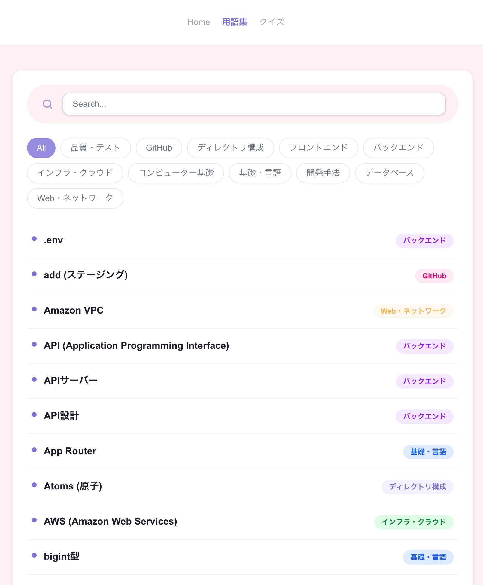
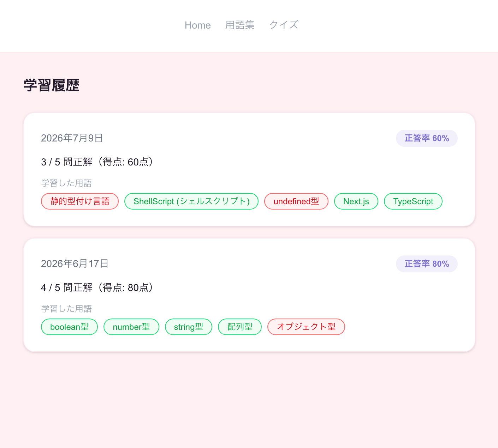
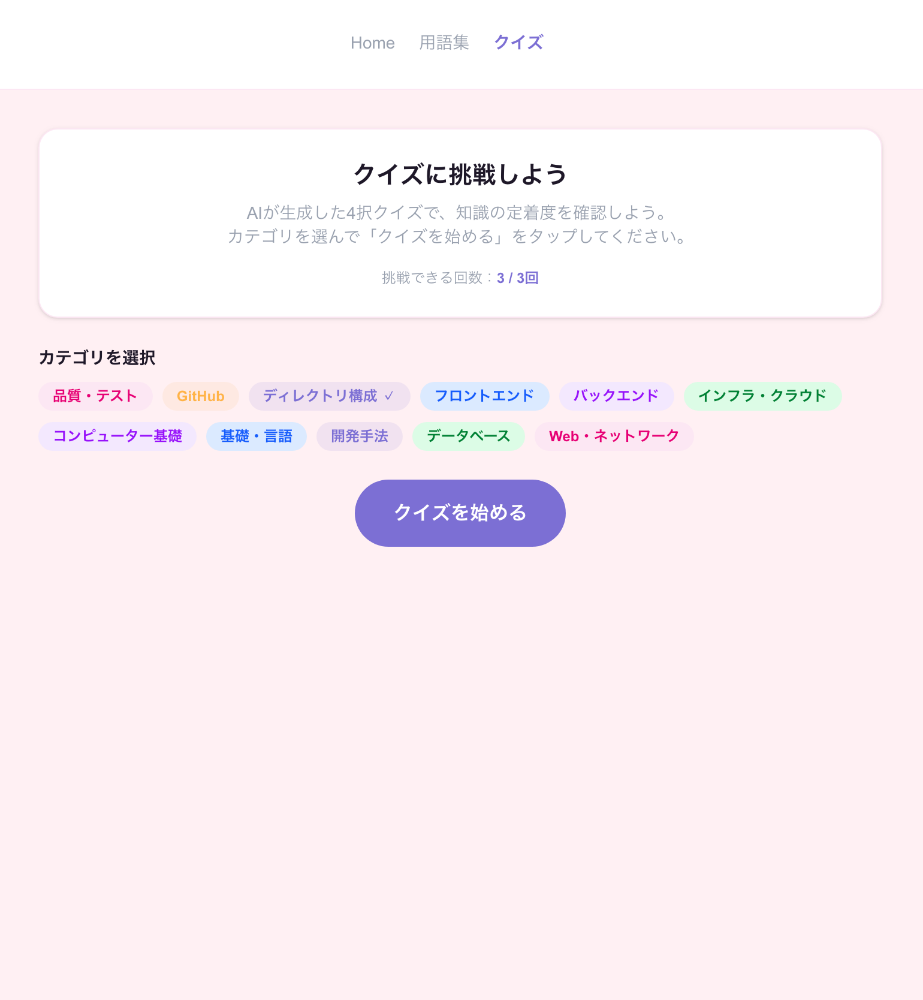
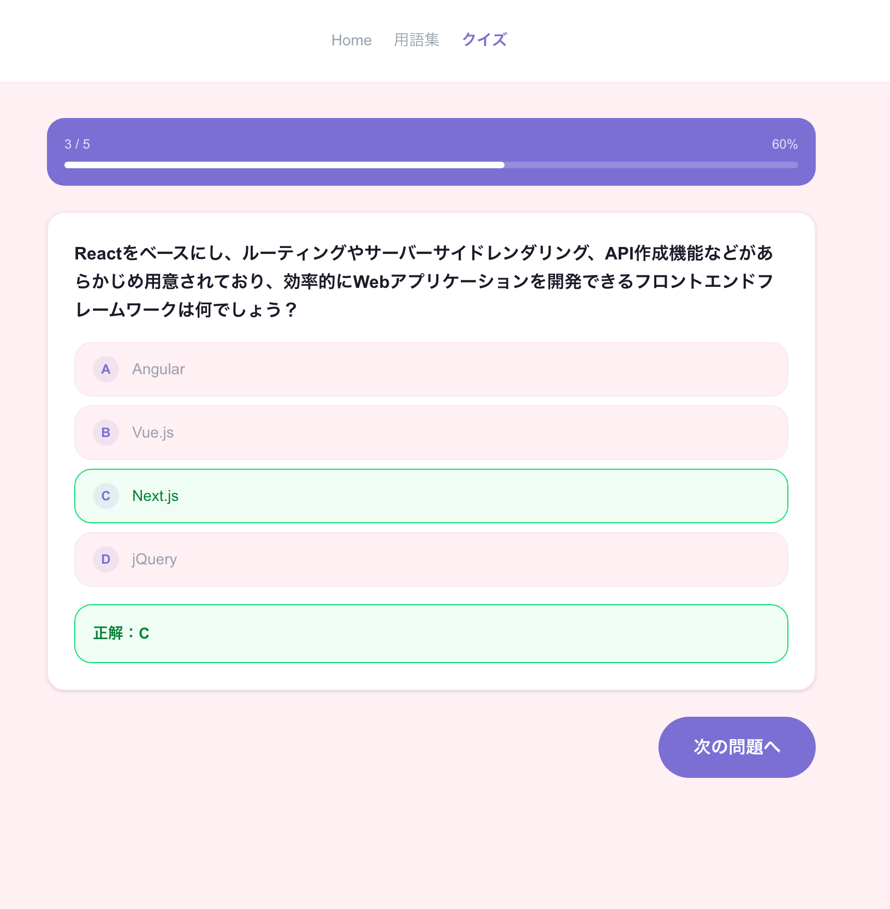
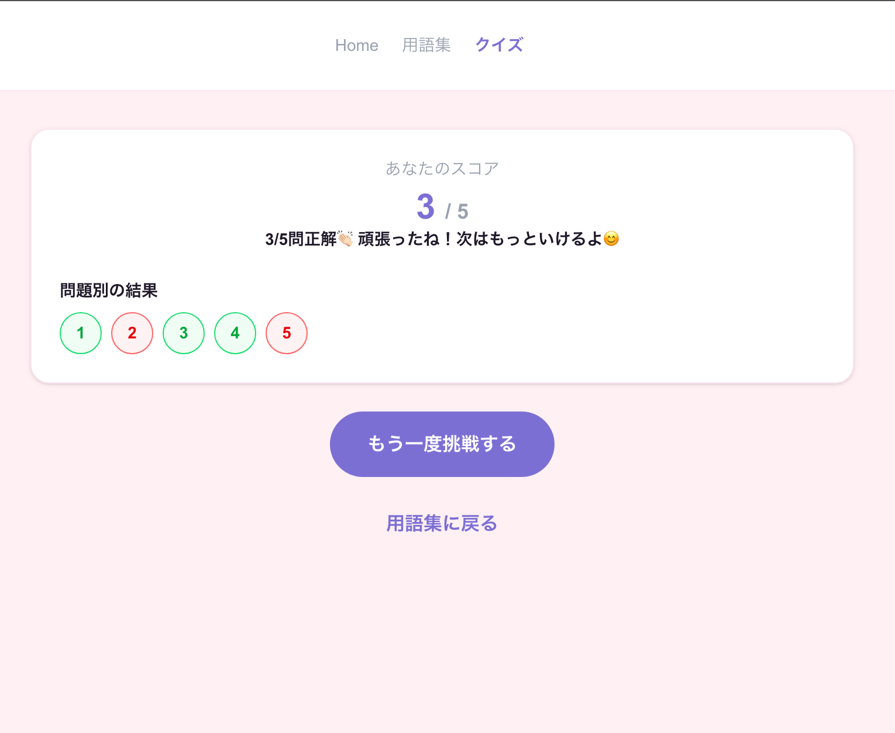

# プログミ - Progumi -

## 概要

プログミ - Progumi - は、IT用語を学習するための学習支援アプリです。

ユーザーは用語集で知識を学び、AIが生成する4択クイズを通して理解度を確認できます。

また、会員登録を行うことでクイズ結果を保存し、学習履歴を振り返ることができます。

---

## デモ

<p>
  <a href=""></a>
  <a href=""></a>
  <a href=""></a>
  <a href=""></a>
  <a href=""></a>
  <a href=""></a>
</p>

---

# 主な機能

## ゲストユーザー

### 用語集

- 用語一覧表示
- 用語詳細表示

### クイズ

- AIによる4択クイズ出題
- クイズ受験
- 結果表示

---

## 会員ユーザー

### 認証

- 新規登録
- ログイン
- ログアウト

### 学習履歴

- クイズ結果保存
- 学習履歴閲覧

---

## 管理者

### 用語管理

- 用語追加
- 用語編集
- 用語削除

---

# 技術スタック

| 分類                | 技術                    |
| ------------------- | ----------------------- |
| Frontend            | Next.js                 |
| Language (Frontend) | TypeScript              |
| Backend             | FastAPI                 |
| Language (Backend)  | Python                  |
| ORM                 | SQLAlchemy              |
| API Client          | Swagger UI              |
| Database            | PostgreSQL              |
| Container           | Docker / Docker Compose |
| Authentication      | JWT                     |
| AI API              | Gemini                  |
| Cache               | Redis（ADVANCE）        |

---

# ディレクトリ構成

```text
Progumi/
├─ frontend/
│  ├─ src/
│  └─ Dockerfile
│
├─ backend/
│  ├─ app/
│  ├─ tests/
│  └─ Dockerfile
│
├─ docs/
│  ├─ requirements.md
│  ├─ database-design.md
│  ├─ api-design.md
│  ├─ frontend-public-design.md
│  ├─ frontend-admin-design.md
│  └─ dev-guidelines.md
│
├─ docker-compose.yml
├─ .env.example
└─ README.md
```

---

# 環境構築

## 前提条件

以下をインストールしてください。

- Git
- Docker
- Docker Compose

---

## リポジトリ取得

```bash
git clone <repository-url>
cd Progumi
```

---

## 環境変数設定 (バックエンド)

`.env.example` をコピーして `.env` を作成します。

```bash
cp .env.example .env
```

`.env` を開いて以下の値を設定してください。

```env
POSTGRES_USER=postgres
POSTGRES_PASSWORD=postgres
POSTGRES_DB=progumi_db
DATABASE_URL=postgresql://postgres:postgres@db:5432/progumi_db

SECRET_KEY=your_jwt_secret_key_here
GEMINI_API_KEY=your_gemini_api_key_here
```

⚠️ `.env` が未作成のままだとバックエンドが起動時に失敗します。必ず作成してください。

---

## 環境変数設定 (フロントエンド)

`.env.example` をコピーしてフロント用の環境変数ファイルを作成します。

```bash
cp frontend/.env.example .env.local
```

`.env.local` を開いて以下の値を設定してください。

```env
NEXT_PUBLIC_API_URL=http://localhost:8000
INTERNAL_API_URL=http://backend:8000
```

⚠️ `.env.local` が未作成のままだと、フロントエンドからAPI接続時に環境変数が取得できずエラーになります。必ず作成してください。

---

## 補足

- `.env` → バックエンド（ルート）
- `.env.local` → フロントエンド（Next.js）
- それぞれ役割が異なるため、ファイルを混在させないでください

---

## 起動

```bash
docker compose up --build
```

---

## 初期データ投入（Seed）

コンテナ起動後、以下のコマンドでSeedデータを投入してください。

```bash
docker exec -it progumi-backend-1 bash
PYTHONPATH=/app python app/seeds/seed_terms.py
PYTHONPATH=/app python app/seeds/seed_history.py
```

⚠️ 既にデータが存在する場合はスキップされます。

---

## 管理者ユーザーの作成

コンテナ起動後、以下の手順で管理者ユーザーを作成してください。

### 1. パスワードのハッシュ化

```bash
docker compose exec backend python -c "from passlib.context import CryptContext; pwd_context = CryptContext(schemes=['bcrypt'], deprecated='auto'); print(pwd_context.hash('任意のパスワード'))"
```

### 2. DBに管理者ユーザーを作成

```bash
docker compose exec db psql -U ${POSTGRES_USER} -d ${POSTGRES_DB}
```

```sql
INSERT INTO users (id, name, email, password_hash, role)
VALUES (
  gen_random_uuid(),
  'Admin',
  'admin@example.com',
  '上記で生成したハッシュ値',
  'admin'
);
```

⚠️ パスワードは各自で任意のものを設定してください。実際のパスワードはチームメンバーと別途共有してください。

---

# 動作確認URL

| サービス    | URL                        |
| ----------- | -------------------------- |
| Frontend    | http://localhost:3000      |
| Backend API | http://localhost:8000      |
| Swagger UI  | http://localhost:8000/docs |

---

# 開発ルール

## ブランチ命名規則

```text
feature/xxx
fix/xxx
docs/xxx
```

例

```text
feature/login
feature/quiz-api
docs/database-design
```

---

## コミットメッセージ規則

```text
feat:
fix:
docs:
refactor:
test:
chore:
```

※ 開発方針ドキュメントに詳細を記載しているので、確認してください。

---

# 非機能要件

## セキュリティ

- JWT認証
- SQLインジェクション対策
- XSS対策

---

## ログ

- 開発環境: DEBUG
- 本番環境: INFO以上

---

## テスト

- 単体テスト
- 統合テスト
- E2Eテスト（時間に余裕がある場合）

---

# MVPゴール

以下をデモまでに完成させる。

- 用語集機能
- AIによる4択クイズ（1回5問出題）
- 新規登録
- ログイン
- クイズ履歴保存
- 管理画面CRUD

---

# 今後の展望

- 学習分析レポート
- 苦手分野分析
- 問題ごとの正答率分析
- Redisによるキャッシュ最適化
- モバイルUI改善
- クイズ出題アルゴリズム改善

---

# 関連ドキュメント

- docs/requirements.md
- docs/database-design.md
- docs/api-design.md
- docs/frontend-public-design.md
- docs/frontend-admin-design.md
- docs/dev-guidelines.md
