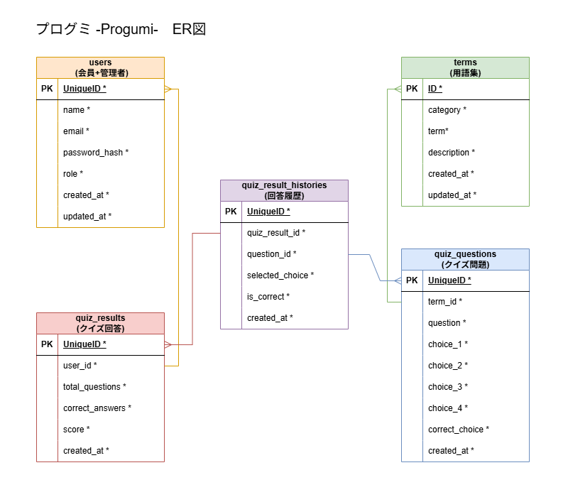

# データベース設計書

## 概要

学習アプリで利用するデータベース設計を定義する。

本設計書は、バックエンドAPI実装およびフロントエンド開発時の共通認識として利用する。

---

# テーブル一覧

| テーブル名               | 説明             |
| ----------------------- | ---------------- |
| users                   | ユーザー情報     |
| terms                   | 用語集情報       |
| quiz_questions          | AI生成クイズ問題 |
| quiz_results            | クイズ結果       |
| quiz_result_histories   | 回答履歴         |

---

# users

## 概要

アプリ利用ユーザーを管理する。

管理者・一般ユーザーを同一テーブルで管理する。

## テーブル定義

| カラム名       | 型           | 必須 | FK  | 説明                 |
| ------------- | ------------ | ---- | --- | -------------------- |
| id            | UUID         | ○    |     |  ユーザーID           |
| name          | VARCHAR(100) | ○    |     |  ユーザー名           |
| email         | VARCHAR(255) | ○    |     |  メールアドレス       |
| password_hash | VARCHAR(255) | ○    |     |  ハッシュ化パスワード  |
| role          | VARCHAR(20)  | ○    |     |  admin / user        |
| created_at    | TIMESTAMP    | ○    |     |  作成日時             |
| updated_at    | TIMESTAMP    | ○    |     |  更新日時             |

---

# terms

## 概要

学習用語を管理する。

クイズ生成元となるデータを保持する。

## テーブル定義

| カラム名     | 型           | 必須 | FK  | 説明     |
| ----------- | ------------ | ---- | --- | -------- |
| id          | UUID         | ○    |     | 用語ID   |
| category    | VARCHAR(100) | ○    |     | カテゴリ |
| term        | VARCHAR(255) | ○    |     | 用語名   |
| description | TEXT         | ○    |     | 解説     |
| created_at  | TIMESTAMP    | ○    |     | 作成日時 |
| updated_at  | TIMESTAMP    | ○    |     | 更新日時 |

---

# quiz_questions

## 概要

AI生成したクイズ問題を保存する。

また、選択肢は4択固定とする。

## テーブル定義

| カラム名       | 型        | 必須  | FK  | 説明     |
| -------------- | --------- | ---- | --- | -------- |
| id             | UUID      | ○    |     | 問題ID   |
| term_id        | UUID      | ○    | ○   | 用語ID   |
| question       | TEXT      | ○    |     | 問題文   |
| choice_1       | TEXT      | ○    |     | 選択肢1  |
| choice_2       | TEXT      | ○    |     | 選択肢2  |
| choice_3       | TEXT      | ○    |     | 選択肢3  |
| choice_4       | TEXT      | ○    |     | 選択肢4  |
| correct_choice | INTEGER   | ○    |     | 正解番号 |
| created_at     | TIMESTAMP | ○    |     | 作成日時 |

---

# quiz_results

## 概要

ログインユーザーのクイズ結果を保存する。

ゲストユーザーの履歴は保存しない。

## テーブル定義

| カラム名         | 型        | 必須 | FK  | 説明       |
| --------------- | --------- | ---- | --- | ---------- |
| id              | UUID      | ○    |     | 結果ID     |
| user_id         | UUID      | ○    | ○   |ユーザーID  |
| total_questions | INTEGER   | ○    |     | 出題数     |
| correct_answers | INTEGER   | ○    |     | 正答数     |
| score           | INTEGER   | ○    |     | 得点       |
| created_at      | TIMESTAMP | ○    |     | 受験日時   |

---

# quiz_result_histories

## 概要

ログインユーザーのクイズ結果を回答履歴に表示する。

ゲストユーザーの履歴は表示しない。

## テーブル定義

| カラム名         | 型        | 必須 | FK  | 説明       |
| --------------- | --------- | ---- | --- | ---------- |
| id              | UUID      | ○    |     | 履歴ID     |
| quiz_result_id  | UUID      | ○    | ○   | 結果ID     |
| question_id     | UUID      | ○    | ○   | 問題ID     |
| selected_choice | INTEGER   | ○    |     | 選択番号   |
| is_correct      | BOOLEAN   | ○    |     | 正誤フラグ |
| created_at      | TIMESTAMP | ○    |     | 回答日時   |

---

# リレーション

## users - quiz_results

```text
users
  1
  │
  └── N
       quiz_results
```

## terms - quiz_questions

```text
terms
  1
  │
  └── N
       quiz_questions
```

## quiz_questions - quiz_result_histories

```text
quiz_questions
  1
  │
  └── N
       quiz_result_histories
```

## quiz_results - quiz_result_histories

```text
quiz_results
  1
  │
  └── N
       quiz_result_histories
```

---

# ER図



---

# Seedデータ方針

## 初期Seed

- terms 10件

## 中期Seed

- terms 30件

## 最終Seed

- terms 50件以上

---

# 将来拡張候補

## クイズ詳細分析レポート

### 概要

クイズ結果の詳細分析機能で利用する想定。

`quiz_result_questions` と `terms` の既存データを活用し、
カテゴリー別の正答率など、ユーザーの学習状況を分析・表示する。

※ MVPでは未実装  
※ 必要性をチームで検討後に実装を判断する

### 想定利用例

```text
クイズ結果

80点
↓
詳細を見る
↓
カテゴリーA 正答率 90%
カテゴリーB 正答率 60%
カテゴリーC 正答率 75%
```

新規テーブルは不要。`quiz_result_histories` と `terms` の既存データで実現できる。

---

# 備考

- データベースは PostgreSQL を利用する
- ORMは SQLAlchemy を利用する
- マイグレーションは Alembic を利用する
- Seedデータの投入手順は README.md を参照
- 認証方式は JWT を利用する
- テーブル定義変更時は本ドキュメントを更新する

## AI生成クイズの保存方針

AI生成したクイズ問題は `quiz_questions` テーブルに保存する。

開発期間・デモ規模を考慮し、当初予定していたRedisによるキャッシュ化は見送り、
シンプルなDB保存方式を採用する。

### 将来的な改善候補

データ量増加に伴いストレージ圧迫やパフォーマンス低下が懸念される場合は、
Redisを用いた一時キャッシュ（24時間保持）への移行を検討する。

## ゲストユーザーのクイズ結果について

ゲストユーザーもクイズを受験できる。

ただし、クイズ結果はデータベースへ保存しない。

クイズ結果はフロントエンド側で一時保持し、

```text
クイズ受験
↓
結果表示
↓
会員登録
↓
履歴保存
```

のフローを想定する。

### 一時保持データの内容

フロントエンドは以下のデータをセッション等で一時保持する。

- total_questions（出題数）
- correct_answers（正答数）
- score（得点）
- 各問題の question_id / selected_choice / is_correct

### 保存タイミング

会員登録完了後、user_id が発行された時点で以下の順で保存する。

1. quiz_results に user_id を付与して保存 → quiz_result_id を取得
2. 取得した quiz_result_id を使って quiz_result_histories を保存

### トランザクション

`quiz_results` と `quiz_result_histories` の保存は
トランザクションでまとめて行う。

途中で失敗した場合は両方ロールバックし、
データの整合性を保つ。

## 採点ロジックについて

選択肢は4択固定とし、`selected_choice`（ユーザーの選択番号）と `correct_choice`（正解番号）は
どちらも 1〜4 の整数値を使用する。

両者を比較し、一致した場合に `is_correct` を `true` とする。

例：
- correct_choice: 2
- selected_choice: 2
- is_correct: true
