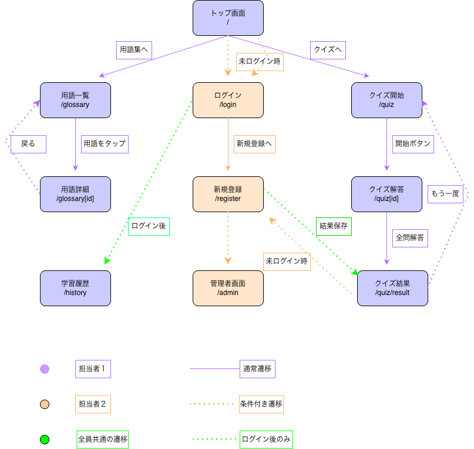

# フロントエンド設計書（公開画面）

---

## 1. 概要

プログミ（Progumi）の公開画面（Top・用語集・クイズ）の画面設計書。
フロントエンド実装を円滑に進めるため、画面一覧・画面遷移・
URL設計・UI方針を整理する。

---

## 2. 技術スタック

| 項目               | 技術                  |
|--------------------|-----------------------|
| フレームワーク       | Next.js（App Router） |
| 言語               | TypeScript            |
| スタイル           | Tailwind CSS          |
| APIクライアント     | fetch（未定）          |

---

## 3. 画面一覧

| 画面名           | パス               | アクセス権限     |
|-----------------|-------------------|------------------|
| Top画面         | /                  | 全員             |
| 用語集一覧画面    | /glossary          | 全員             |
| 用語詳細画面     | /glossary/[id]      | 全員             |
| クイズ開始画面   | /quiz               | 全員             |
| クイズ回答画面   | /quiz/[id]          | 全員             |
| クイズ結果画面   | /quiz/result        | 全員             |
| 学習履歴画面     | /history            | 会員ユーザーのみ   |

---

## 4. 画面遷移図

---

## 5. URL設計

| パス                | 説明                           | 動的ルーティング |
|---------------------|-------------------------------|------------------|
| /                   | Top画面                       | なし             |
| /glossary           | 用語集一覧                     | なし             |
| /glossary/[id]      | 用語詳細（用語IDで動的表示）      | あり             |
| /quiz               | クイズ開始                     | なし             |
| /quiz/[id]          | クイズ回答（問題IDで動的表示）.   | あり             |
| /quiz/result        | クイズ結果                     | なし             |
| /history            | 学習履歴                       | なし             |

---

## 6. 各画面の詳細

### 6-1. Top画面（/）

**概要**
アプリのエントリーポイント。
用語集・クイズへの導線と最近の学習履歴を表示する。

**表示内容**
- アプリ名・キャッチコピー
- 用語集へのリンクカード
- クイズへのリンクカード
- 最近の学習履歴フィード（ログイン時のみ表示）

**権限**
- 未ログインでもアクセス可能
- 学習履歴フィードはログイン時のみ表示

---

### 6-2. 用語集一覧画面（/glossary）

**概要**
IT用語の一覧を表示する。
検索・カテゴリフィルターで絞り込み可能。

**表示内容**
- 検索ボックス
- カテゴリフィルタータグ
- 用語リスト（用語名・カテゴリバッジ・説明文）

**権限**
- ゲストユーザーもアクセス可能

---

### 6-3. 用語詳細画面（/glossary/[id]）

**概要**
選択した用語の詳細を表示する。

**表示内容**
- 用語名
- カテゴリ
- 詳細説明
- 関連用語（あれば）

**権限**
- ゲストユーザーもアクセス可能

---

### 6-4. クイズ開始画面（/quiz）

**概要**
クイズの説明とカテゴリ選択を行う。

**表示内容**
- クイズの説明文
- カテゴリ選択
- 開始ボタン

**権限**
- ゲストユーザーも受験可能

---

### 6-5. クイズ回答画面（/quiz/[id]）

**概要**
AIが生成した4択クイズを出題する。
ゲストユーザーの場合、回答データをセッションで一時保持する。

**表示内容**
- 進捗バー（現在の問題番号）
- 問題文
- 4択の選択肢
- 正解・不正解のフィードバック
- 解説文

**権限**
- ゲストユーザーも受験可能
- ログインユーザーのみ結果を自動保存する

**一時保持データ（セッション）**
ゲストユーザーの回答データを以下の形式でセッションに保持する。
保存処理は会員登録完了時に一括で行う（6-6参照）。

| データ名           | 説明           |
|-------------------|----------------|
| total_questions   | 出題数         |
| correct_answers   | 正答数         |
| score             | 得点           |
| question_id       | 問題ID         |
| selected_choice   | 選択した回答    |
| is_correct        | 正解かどうか    |

---

### 6-6. クイズ結果画面（/quiz/result）

**概要**
クイズ終了後のスコアと振り返りを表示する。
未ログインユーザーには会員登録への導線を表示する。

**表示内容**
- スコア（正答数 / 全問数）
- 問題ごとの正解・不正解の振り返り
- もう一度挑戦ボタン
- 用語集に戻るボタン
- 未ログイン時：会員登録への導線
  （「登録すると結果を保存できます」）

**権限**
- 全員アクセス可能
- 結果の保存はログインユーザーのみ

**保存タイミング**
会員登録完了後、user_id が発行された時点で以下の順で保存する。

**保存の責務とトリガー**
セッションに保持したクイズデータの保存責務は
会員登録完了画面（/register）が持つ。

保存トリガー：user_idが発行された時点
保存の流れ：
1. POST /api/quiz/results
   → user_idを付与して保存
   → quiz_result_idを取得
2. POST /api/quiz/result/questions
   → quiz_result_idを使って各問題の結果を保存
3. クイズ結果画面にリダイレクト

※ 保存処理の実装はメンバー②（登録画面担当）と連携する

---

### 6-7. 学習履歴画面（/history）

**概要**
過去のクイズ結果・学習記録を一覧表示する。

**表示内容**
- 日付別の学習記録
- クイズの正答率
- 学習した用語一覧

**権限**
- 会員ユーザーのみアクセス可能
- 未認証の場合は /login にリダイレクト

---

## 7. UI設計方針

### カラーパレット

| 役割               | カラーコード  | 用途                         |
|--------------------|---------------|------------------------------|
| ベース背景           | #FFF0F3       | 全体の背景色                |
| メインアクセント      | #7C6FD4       | ボタン・ナビ・見出し         |
| サブアクセント        | #FFB347       | 通知・ポイント・強調         |
| カード背景           | #FFFFFF       | カード・モーダル             |
| テキスト             | #1E1828       | 本文テキスト                |

### 共通レイアウト

- ヘッダー：ロゴ（プログミ / Progumi）＋ナビゲーション＋ログインボタン
  - 未ログイン時：「ログイン」ボタンを表示
  - ログイン時：「ログアウト」ボタンを表示
- フッター：未定
- 角丸：border-radius 大きめ（20px〜28px）
- 余白：広めに設定

### レスポンシブ対応方針

- MVP段階ではPC優先
- ADVANCE対応としてモバイル対応を行う

---

## 8. コンポーネント設計

### 共通コンポーネント

| コンポーネント名 | 説明                   | 使用画面       |
|------------------|---------------------|----------------|
| NavBar           | ナビゲーションバー     | 全画面         |
| Button           | 汎用ボタン            | 全画面         |
| Card             | 汎用カード            | 全画面         |
| Badge            | カテゴリバッジ         | 用語集・クイズ  |

### 画面別コンポーネント

| コンポーネント名 | 説明                    | 使用画面     |
|------------------|----------------------|--------------|
| HeroSection      | ヒーローエリア         | Top          |
| MenuCard         | 用語集・クイズへの導線  | Top          |
| ActivityFeed     | 学習履歴フィード       | Top          |
| SearchBox        | 検索ボックス           | 用語集       |
| TagFilter        | カテゴリフィルター      | 用語集       |
| TermItem         | 用語リストの1行        | 用語集       |
| ProgressBar      | クイズ進捗バー         | クイズ       |
| ChoiceButton     | 選択肢ボタン           | クイズ       |
| ResultCard       | 結果表示カード         | クイズ結果    |

---

## 9. API連携

| 画面            | メソッド  | エンドポイント（予定）         | 備考                     |
|----------------|----------|----------------------------|--------------------------|
| 用語集一覧       | GET      | /api/terms                 | 検索・フィルター対応        |
| 用語詳細         | GET      | /api/terms/[id]            |                         |
| クイズ回答       | GET      | /api/quiz                  | AI生成問題取得             |
| クイズ結果保存    | POST     | /api/quiz/results          | ログインユーザーのみ        |
| 問題別結果保存    | POST     | /api/quiz/result/questions | quiz_result_id取得後に保存 |
| 学習履歴         | GET      | /api/history               | 認証必須                  |

### クイズ結果の保存フロー

ゲストユーザーが会員登録した場合の保存フローは以下の通り。

1. セッションに一時保持していたデータを取得する
2. POST /api/quiz/results
   → user_id を付与して保存
   → レスポンスで quiz_result_id を取得
3. POST /api/quiz/result/questions
   → quiz_result_id を使って各問題の結果を保存

※APIの詳細は api-design.md を参照

---

## 10. 未決定事項

- [ ] APIクライアントの選定（fetch / axios）
- [ ] 状態管理の方針
- [ ] クイズの出題形式（通常 / チャット形式）
- [ ] フッターの設計
- [ ] レスポンシブ対応の優先度